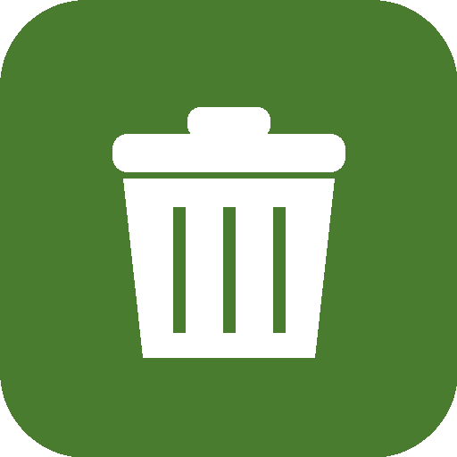
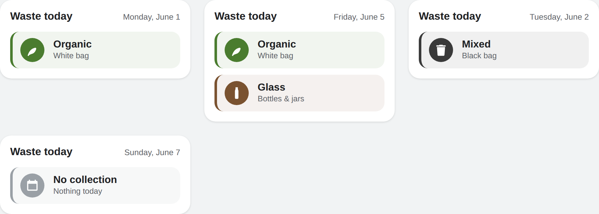

#  Skart Malta Card

A minimal, customisable Lovelace card for displaying Malta's daily waste collection in Home Assistant.

> **Skart** is Maltese for *waste / rubbish*.



> 🧩 **Requires the integration:** this card displays sensors provided by
> **[ha-skart-malta](https://github.com/beta-j/ha-skart-malta)**. Install and configure that integration first, then add this card to your dashboard.

## Installation (HACS)

1. In HACS, open the **⋮** menu → **Custom repositories**.
2. Add `https://github.com/beta-j/ha-skart-malta-card` with category **Dashboard** (also called *Lovelace* / *Plugin*).
3. Install **Skart Malta Card**.
4. HACS adds it as a dashboard resource automatically. If not, add a resource pointing to
   `/hacsfiles/ha-skart-malta-card/skart-malta-card.js` as a **JavaScript Module**.

## Usage

Add the card to a dashboard (Edit dashboard → Add card → Manual / or pick "Skart Malta Card"):

```yaml
type: custom:skart-malta-card
entity: sensor.skart_malta_today
title: Skart illum
language: en
show_date: true
colors:
  organic: "#4a7c2f"
  mixed: "#3a3a3a"
  recyclable: "#2f6fa0"
  glass: "#7a5230"
```

### Options

| Option      | Type    | Default            | Description                                            |
|-------------|---------|--------------------|--------------------------------------------------------|
| `entity`    | string  | *(required)*       | A Skart Malta day sensor, e.g. `sensor.skart_malta_today` or `sensor.skart_malta_tomorrow`. |
| `title`     | string  | `Waste collection` | Card heading.                                          |
| `language`  | string  | `en`               | Display language for the waste labels: `en` (English) or `mt` (Maltese). |
| `show_date` | boolean | `true`             | Show the date for the selected day.                    |
| `colors`    | map     | built-in palette   | Per-stream colour overrides (`organic`, `mixed`, `recyclable`, `glass`). All keys optional. |

The `language` option only changes the **display** labels on the card; the underlying sensor states stay language-neutral so automations and history are unaffected. Labels render as:

| Stream     | English (`en`)            | Maltese (`mt`)                         |
|------------|---------------------------|----------------------------------------|
| organic    | Organic — White bag       | Organiku — Borża Bajda                 |
| mixed      | Mixed — Black bag         | Imħallat — Borża Sewda                 |
| recyclable | Recyclable — Grey bag     | Riċiklabbli — Borża Griża              |
| glass      | Glass — Bottles & jars    | Ħġieġ                                  |
| none       | No collection — Nothing today | Xejn — Ma jinġabarx skart illum    |

The card reads the `streams` and `date` attributes exposed by the integration's sensors, so a single Friday can show both organic **and** glass when due.

## Notes

- This card is display-only; all schedule logic lives in the [ha-skart-malta](https://github.com/beta-j/ha-skart-malta) integration.
- Unofficial project, not affiliated with WasteServ, any local council, or the Government of Malta.

## License

MIT
